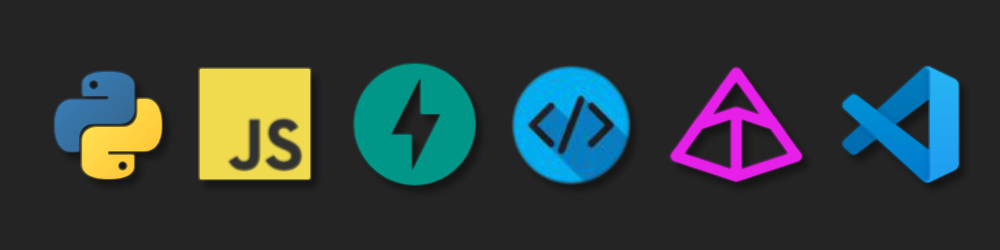

<div align="center">



<br/>


<br/>

<!--  -->
[](https://www.linkedin.com/in/abhishek-kumar-singh-a12590231)
[](https://github.com/Abhishekkrsingh2023)
[](mailto:abhikrsingh.dev@gmail.com)

</div>

<br/>

## ⚡ `> whoami`

```yaml
name: Abhishek Kumar Singh
role: Python Developer / Backend Engineer / Full-Stack Builder
location: Kolkata, India
focus: Python backends · REST APIs · Full-stack web apps
interests: Backend engineering · System design · Automation
databases: Relational DBs · ORM design · Schema migrations
looking_for: Collabs on FastAPI, React, Dockerized & Node.js projects
```

<br/>

## 🧬 Tech Stack

<div align="center">

**Core Language**


**Backend Engineering**


**Databases & ORM**


**Frontend**


**DevOps & System Tools**


</div>

<br/>

## 🚀 Currently Building

<table>
<tr>
<td width="50%" valign="top">

### 📝 Blog SPA (FARM Stack)
FastAPI + React + MongoDB blog platform with SEO crawler middleware, server-side Markdown rendering via `mistune`, and cookie-based JWT auth.

</td>
</tr>
<tr>
<td width="50%" valign="top">

### 🎞️ GIF Compressor Service
FastAPI + `gifsicle` Dockerized service with frame-skip control, compression stat headers, and background temp-file cleanup.

</td>
<td width="50%" valign="top">

### 🧾 Markdown → PDF/DOCX Exporter
FastAPI service using `pypandoc` to convert Markdown into polished PDF and DOCX output.

</td>
</tr>
</table>

<br/>

## 📊 GitHub Stats

<div align="center">


</div>

<br/>

## 🌐 Let's Connect

<div align="center">

[](https://www.linkedin.com/in/abhishek-kumar-singh-a12590231)
[](https://github.com/Abhishekkrsingh2023)
[](mailto:abhikrsingh.dev@gmail.com)

<br/>

> *"Building fast APIs and smart interfaces — one commit at a time."*

</div>